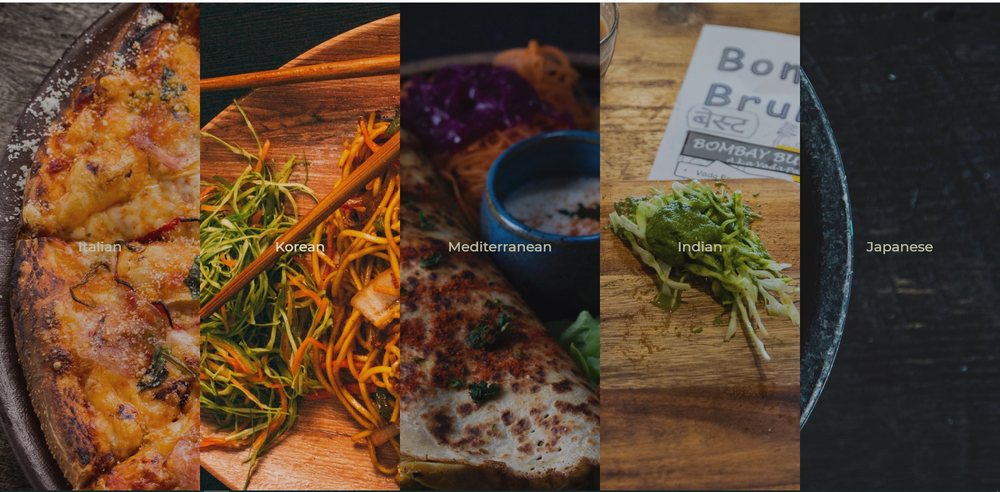

# <h1 align="center"> 👋Welcome to the Flex-Food👋 </h1>
Your Ultimate Food Gallery; Made with 💗 & FlexBox.

## Live URL
Wanna try it out, I got you covered 😎

Here's the live URL: http://food-flex.surge.sh/   

## How To
This is how the app looks like-

Click on the image to see the magic of flexbox & some awesome foods!🍕🍠🍗🍝

## Tech I Used
This app is purely made with vanilla JavaScript & raw HTML/CSS. It is to demonstrate, if you can be creative you can make something amazing out of those core technologies.

Key topics-
+ **HTML:** I used custom data- attribute & audio tag
+ **CSS:** It is heavy on CSS espcecially flexbox. It put my flexbox knowledge in test. Learned a lot.
+ **JS:** I used DOM manipulation technique to co-ordinate transition and classes. Events that I used are mainly click and transitionend

## Disclaimer
+ The images are from Unsplash & rights belong to the respective artist.
+ This is greatly inspired by Wes Bos 30 days JavaScript course. Awesome Course! Couldn't recommend it more. https://javascript30.com/
